# 🧁 FoMoXD

## Game Flow

```mermaid
stateDiagram
    direction LR
    [*] --> Player: purchase puffs 🧁
    state Player {
      direction LR
      player --> nftWinner: airdrop NFT 🖼️
      player --> ethWinner: airdrop ETH 🪙
    }
    Player --> NoTime⏰ 
    NoTime⏰  --> GameOver🤡 : got nothing but puffs 🧁
    NoTime⏰  --> finalPotWinner🤑: final one bought puff 💰
    NoTime⏰  --> nftWinner👨🏻‍🎨: got NFTS 🖼️
```

### How to get NFTs?

- Be the first 10 players to entry game with at least one ETH.
- Be so lucky to get the airdrop when purchase puffs over 0.01 ETH.

### User Vault

```mermaid
flowchart LR
    1[User Vault] --o 2[winnings vault 最後一輪獎勵]
    1 --o 3[general vault 隊伍獎勵]
    1 --o 4[affiliate vault 推薦獎勵]
    
```

## Modules

```mermaid
    stateDiagram-v2
      FOMO --> PlayerBook
        note right of PlayerBook
            playerBook 讓 name 可以續用
        end note
      FOMO --> FOMOXD
      note right of FOMOXD
            主要對接使用者
        end note
      FOMO --> FOMOERC721
      FOMO --> FOMOERC20
      FOMO --> Comminuty
      FOMO --> Devide

```

# Credit
- NFT Images
  - <https://giventofly.github.io/pixelit/>

## Music Credit
-  Background
   - [Youtube Studio](https://studio.youtube.com/channel/UCt4Szwqj1S7I_hA4eZvwK5g/music)
   - [Half.cool](https://www.youtube.com/channel/UCtkVGyrwbsvv0yU6Hn5RG4A)
- Sound Effect
  - [Coin](https://sc.chinaz.com/yinxiao/220716414170.htm)
  - [on/off sound comes from](https://taira-komori.jpn.org/openclose01tw.html)
