# 🧁 FoMoXD - Blockchain Dapp
## A Lottery Ponzi Game
#### Rules
- Winner is the last person to purchase Puffs — a lottery ticket — using ETH before the countdown timer runs down to zero.
- During games every player has chance to get ETH, NFT airdrops
## Feature
- Integrated Profit-sharing token, NFTs, DAO, Multi-sig wallet
- Utilizes the hardhat framework for development and testing

## Steps for E2E test

- Run the hardhat node

```bash
npx hardhat node
```
- Add the test network and account to Metamak
  - Import hardhat test private key
  - Import hardhat network


- Deploy contracts with Hardhat 

```bash
npm run deploy
```
- Update Contract Address in config file

```bash
vi webapp/.env
# Add the address
REACT_APP_FOMO_CONTRACT_ADDRESS=YOUR_FOMO_CONTRACT_ADDRESS
REACT_APP_FOMOERC721_CONTRACT_ADDRESS=YOUR_FOMO_NFT_CONTRACT_ADDRESS
```
- Run the web server with docker

```bash
docker build -t fomoxd . --no-cache
docker run -p 3000:3000 fomoxd
```

## Steps for Integration Test

```bash
cd chain
npm i 
npx hardhat node
npm run test

```

## Game Flow

```mermaid
stateDiagram
    direction LR
    [*] --> Player: Purchase puffs 🧁
    note right of Player
       As supply for Pufss increases, the price will rise ⤴️
    end note
    state Player {
      direction LR
      player --> nftWinner: Airdrop NFT 🖼️
      player --> ethWinner: Airdrop ETH 🪙
      player --> Affiliate: Get affiliate ETH 👥
    }
    Player --> NoTime⏰ 
    NoTime⏰  --> GameOver🤡 : got nothing but puffs 🧁
    NoTime⏰  --> finalPotWinner🤑: final one bought puff 💰
    NoTime⏰  --> nftWinner👨🏻‍🎨: reveal mystery NFTS 🖼️
```




## Smart Contract Modules

```mermaid
    stateDiagram-v2
      FOMOXD --> PlayerBook
      note left of FOMOXD
          對接使用者
        end note
        note right of PlayerBook
          Leaderboard
        end note
      FOMOXD --> FOMOERC721
        note right of FOMOERC721
          Airdrop NFT
        end note
      FOMOXD --> PXD
        note right of PXD
          Profit-sharing token
        end note
      FOMOXD --> Comminuty
        note right of Comminuty
          DAO/multi-sig wallet
        end note
      FOMOXD --> Devide
        note right of Devide
          profit-sharing tokens
        end note
      FOMOXD --> Oracle
        note right of Oracle
          random number genarator
        end note
```



1. Player Book: A ledger of all games' leaderboard of recommended players.
2. FoMoERC721: Airdrop NFT mystery box during each round and reveal NFTs of the round at the end of the round.
3. PXD: A profit-sharing tokens that allows holders to share in the profits generated by the underlying games.
4. Comminuty: A decentralized governance system that uses a multi-sig wallet which decisions are made and actions are taken based on the consensus of multiple parties.
5. Devide: Responsible for calculating and distributing profits to the holders of the tokens
6. Oracle: Obtaining a random number from an Oracle. Once the random number has been generated, the game then use it to determine whether or not a player is a airdrop winner.

# Profit-sharing System

### Internal

### User Vault

- Team Vault
- Affiliate Vault
- Winning Vault


### External
- PXD
- Community


# Assets Credits
### NFT Images
- <https://giventofly.github.io/pixelit/>
- [JillyPuff](https://twitter.com/scrixels/status/1136653042642817024)

### Music Credit
-  Background
   - [Youtube Studio](https://studio.youtube.com/channel/UCt4Szwqj1S7I_hA4eZvwK5g/music)
   - [Half.cool](https://www.youtube.com/channel/UCtkVGyrwbsvv0yU6Hn5RG4A)
- Sound Effect
  - [Coin](https://sc.chinaz.com/yinxiao/220716414170.htm)
  - [on/off sound comes from](https://taira-komori.jpn.org/openclose01tw.html)
